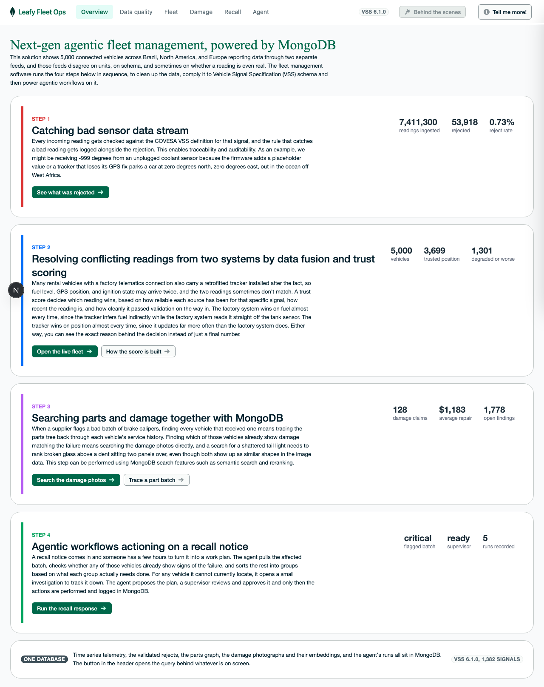
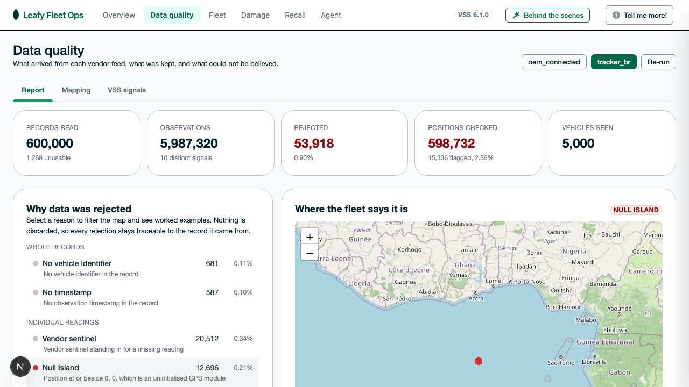
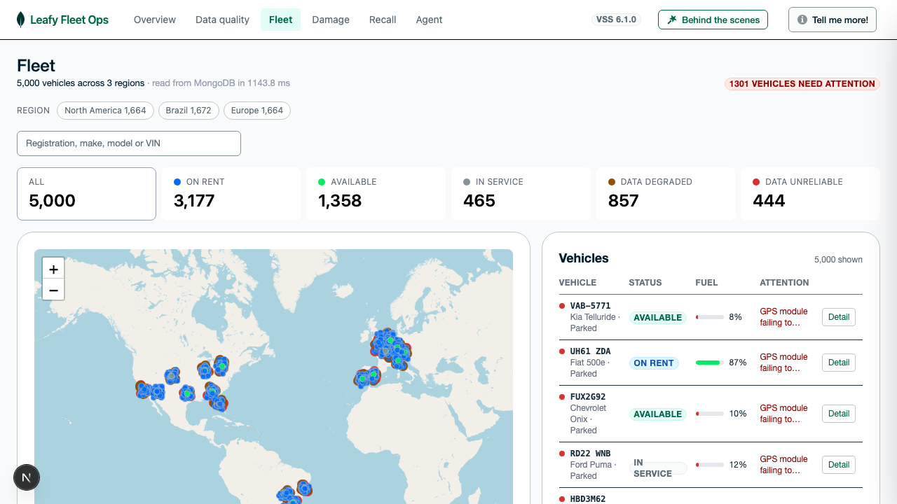
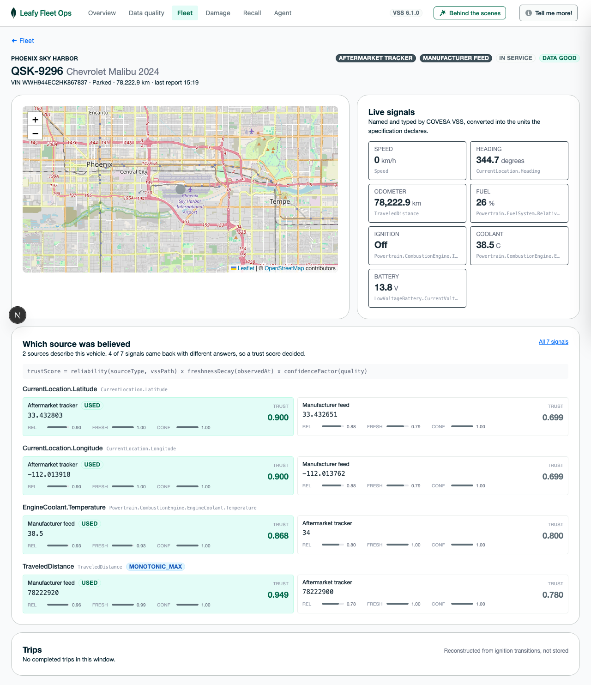
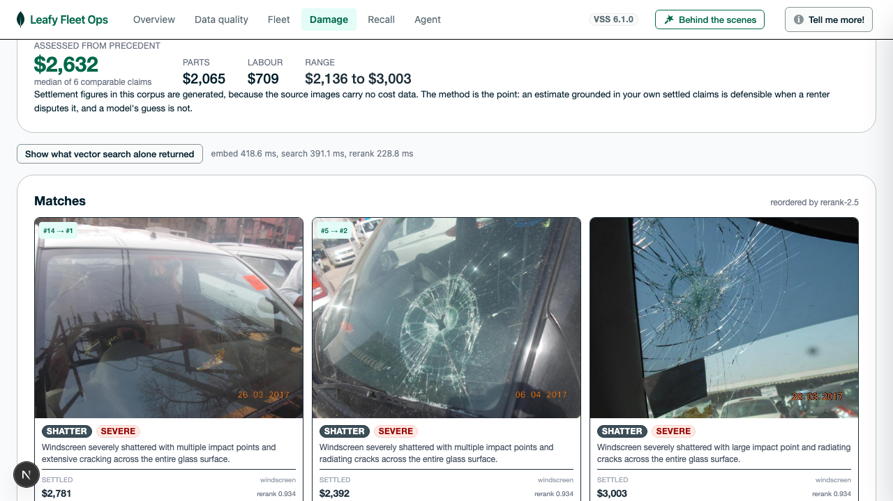
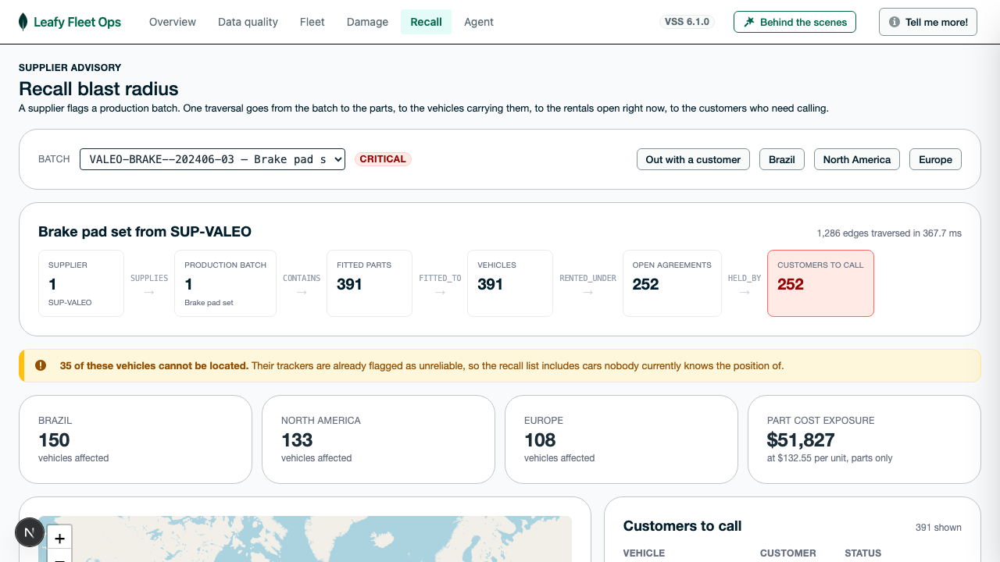
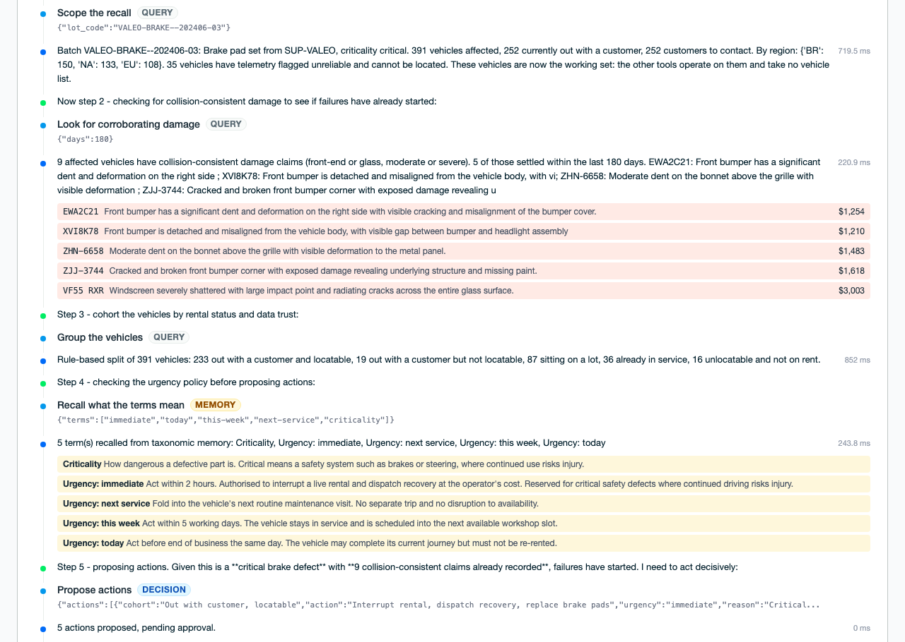

# Agentic Fleet Management

This solution shows 5,000 connected vehicles across Brazil, North America, and Europe reporting data through two separate feeds, and those feeds disagree on units, on schema, and sometimes on whether a reading is even real. The fleet management software runs the four steps below in sequence, to clean up the data, comply it to Vehicle Signal Specification (VSS) schema and then power agentic workflows on it.


This solution is built on COVESA VSS 6.1.0 and MongoDB Atlas. A **Behind the scenes** panel
shows the collection, the query and the capability behind whatever is on screen.



## Run it

```bash
make setup                  # uv sync + npm install
cp backend/env.example backend/.env    # add MONGODB_URI, VOYAGE_API_KEYS and AWS_PROFILE or your AWS Credentials
make sample                 # 5,000 vehicles and their tracker extract
make load                   # map, validate, fuse and write to Atlas
make graph                  # build the ontology and the parts graph
make claims                 # label, embed and index the damage photos
cd backend && uv run python scripts/seed_agent_memory.py    # the agent's SOP and vocabulary
```

Then run the two services, each in its own terminal:

```bash
make backend                # uvicorn on :8000
make frontend               # next dev on :3000
```

Open http://localhost:3000. `make dev` starts both from one terminal, but it
backgrounds the backend, so Ctrl-C can leave uvicorn holding :8000.

Without a connection string the data quality report still runs, because the
first step of the adoption path deliberately needs no database:

```bash
cd backend && uv run python scripts/quality_report.py
```

## The demo, tab by tab

Six tabs, left to right, in the order you would show them. Each one fails
without the one before it.

### Overview

The argument in four steps, each carrying the number that backs it and a button
through to the screen that proves it.


### Data quality — catching bad sensor data

**The question: can I believe what arrived?**

Every vendor column is mapped onto a COVESA VSS signal by one declarative YAML
file. Naming a path is the whole integration, because the target unit, the
datatype, the valid range and the allowed values all come from
[`vss.json`](vss.json). Nothing is hand-typed.

Then every reading is checked, at four levels, each catching what the one below
cannot:

| Level | Catches | Example |
| --- | --- | --- |
| Value checks generated from the spec | Ranges, allowed sets, formats, vendor sentinels | Coolant at -999 C, fuel at 120%, a malformed VIN |
| Null Island | A position pair that passes both per-leaf range checks | `0, 0` on a fleet that operates nowhere near it |
| The mobility test | An impossible transition between two valid points | 838 km in 30 seconds |
| Service area | Positions outside the operating territory | A car reporting from the mid-Atlantic |

The manufacturer feed rejects nothing. The aftermarket tracker rejects 53,918 of
6 million readings. Selecting a reason filters the map to it, and Null Island is
a real place in the Gulf of Guinea, so every one of those dots is a car we were
told is in the sea.

Nothing is discarded. Each rejection keeps the rule that caught it, so a firmware
release that breaks a batch of trackers shows up as a reject rate that moves.



This tab runs with **no database and no AI**, which is why it is the first step
of the adoption path.

### Fleet — two sources, one truth

**The question: where is everything, and can I act on it?**

A live map of 5,000 vehicles across Brazil, North America and Europe, coloured by
rental status, with the ring showing whether the data about each car can be
believed. Search a registration, click a row to fly the map, press **Detail** for
the vehicle.



Behind it, two feeds describe the same car and disagree: a manufacturer connected
platform identified by VIN, and an aftermarket tracker identified by
registration, each with its own cadence, lag and units. Every candidate is scored
and one is chosen:

```
trustScore = reliability(sourceType, vssPath)
           x freshnessDecay(observedAt)
           x confidenceFactor(quality)
```

Reliability is per source **and** per signal, which is the part that matters.
Measured across 3,443 vehicles seen by both feeds:

| Signal | Winner | Wins | Why |
| --- | --- | --- | --- |
| Fuel level | Manufacturer | 3,443 | Tank sender read off the vehicle bus |
| Ignition | Manufacturer | 3,373 | Reported by the car itself |
| Coolant | Manufacturer | 3,367 | Same |
| Speed | Tracker | 3,443 | Sampled every minute against the OEM's fifteen |
| Position | Tracker | 3,309 | Dedicated GNSS module, and the OEM arrives late |
| Position | Manufacturer | 134 | Where the tracker's GPS quality was poor |
| Coolant | Tracker | 76 | Where the OEM reading had gone stale |

The tail is the interesting part: the same two sources trade wins on the same
signal, for reasons the score makes visible. Every decision is kept, so the
vehicle page can show you which source was believed and why.



Trips are reconstructed from ignition transitions rather than stored, so a missed
processing run costs nothing. Rejection reasons become findings with a
consequence and an action, because "0.9% of readings rejected" is not something
anyone can act on, and a vehicle with enough position rejections is marked
**unreliable** — which is what "cannot be located" means two tabs later.

### Damage — searching photographs

**The question: what is this damage worth?**

Damage photos are read by Claude on Bedrock into a fixed vocabulary of damage
type, panel, severity and angle, because a label that cannot be used as an index
filter is only decoration. `voyage-multimodal-3` then embeds images and text into
**one shared space**, so a typed description and a photograph become directly
comparable.

Vector search is recall and reranking is precision, and the gap between them is
measurable. Searching for **"shattered tail light"**, vector search returns four
rear-end *dents*; `rerank-2.5` pulls genuine shattered glass from **rank 58 to
rank 1**.

The workflow with money attached is pricing from precedent: retrieve the closest
settled claims and quote the median of what those actually cost. An estimate
grounded in your own settled claims is defensible when a renter disputes it, and
a model's guess is not.



### Recall — tracing a part batch

**The question: whose car has the bad part, and who do I call?**

An ontology, split into a TBox of classes and relationships and an ABox of facts,
both in MongoDB. The ABox is one typed edge collection traversed with
`$graphLookup`, and edges that can change carry `validFrom` and `validTo` so a
replaced part stays answerable after the fact. A traversal may only follow edge
types the TBox confirms, which turns the ontology from documentation into a
constraint on what an agent can ask.

A supplier flags a production batch, and the fleet needs the customers currently
driving a car containing something from it. Batch to parts to vehicles to open
agreements to customers: five hops, one query, **391 vehicles and 252 customers
out of 81,514 edges in about 300 ms**.

The number worth pausing on is that **35 of those vehicles cannot be located**,
because the Data quality tab already flagged their trackers as unbelievable. The
recall list includes cars nobody currently knows the position of, which is where
the earlier tabs pay for themselves.



### Agent — acting on the recall

**The question: what do we actually do this afternoon?**

A ReAct agent on LangGraph scopes the batch through the graph, corroborates it
against the damage claims, splits the affected vehicles into cohorts by what each
group needs, and sends a smaller model after every vehicle nobody can locate,
concurrently.

Its memory is three MongoDB collections rather than a prompt:

| Collection | Holds | Why it matters |
| --- | --- | --- |
| `agent_procedures` | The standard operating procedure | Editing the document changes how the agent works, with no deploy |
| `agent_taxonomy` | What this operator's words mean | `immediate` means "act within 2 hours", which is policy no model can infer |
| `agent_episodes` | Conclusions already reached | Keyed to the evidence they were drawn from, so nothing is investigated twice |

LangGraph's MongoDB checkpointer writes every reasoning step as it happens, so a
run is inspectable and resumable rather than a black box.

The trace labels every step **query**, **memory** or **decision**, because the
credibility of an agent rests on not claiming work the rules did. Scoping a
recall is a traversal and takes no judgement. Deciding that a critical part on a
car two hundred kilometres from a depot is worth the disruption of a stop-drive
does. Everything goes to a human, and approving writes nothing to the fleet.

A run costs about **$0.06** and takes about 40 seconds: a Sonnet supervisor and
six concurrent Haiku investigators.



### Measured on this fleet

| | |
| --- | --- |
| Ingested | 803,607 records from two feeds, 7,411,300 observations |
| Rejected | 53,918 readings, retained with the rule that caught each |
| `signal_history` | 802,339 measurements, time series |
| Derived | 4,335 trips, 1,778 findings |
| Fused | 24,241 provenance records, each naming the source that won |
| Graph | 81,514 edges across 8 relationship types |
| Claims | 128 photos, labelled and embedded, 5.9 MB compressed |
| Load time | 250s for both feeds, 49s for the graph |

Simulated telemetry is smoother than real data, so the compression here is
optimistic. Run `scripts/estimate_storage.py` against a real extract before
anyone plans capacity.

## Adopting it with your own data

Everything that differs between fleet operators lives in `profiles/<name>/`. The
core is never edited, so adopting this means adding a directory.

**Step 0.** Run on the generated sample. No account, no data, no meetings.

**Step 1.** Drop a historical extract in `profiles/<name>/data/` and write one
mapping file. Out comes the report, on your own fleet. This step needs no live
integration and no production access, which is why it is the step that actually
happens.

```yaml
source:    { name: my_tracker, sourceType: ACME_TRACKER }
identity:  { column: placa, kind: plate }
timestamp: { column: data_hora, tz: America/Sao_Paulo }
signals:
  velocidade:        { vssPath: Speed, unit: km/h }
  nivel_combustivel: { vssPath: Powertrain.FuelSystem.RelativeLevel, unit: percent, sentinels: [255] }
  ignicao:           { vssPath: Powertrain.CombustionEngine.IsRunning, map: { L: true, D: false } }
```

Check it before running anything:

```bash
cd backend && uv run python scripts/validate_mappings.py --profile my_fleet
```

A path that does not exist, a unit that cannot be converted, or a value map that
produces the wrong datatype fails here rather than months later.

**Step 2.** Real adapters per vendor, which switches on trust scoring and fusion.
**Step 3.** Live streaming for one slice of the fleet.
**Step 4.** Your ontology, your questions, and your own SOP in `agent_procedures`.

Regions, depots, vehicle models and plate formats live in `backend/sim/regions.py`
and a customer profile replaces them wholesale. Nothing in the core assumes a
country.

## Why COVESA VSS

[`vss.json`](vss.json) is the single source of truth for signal metadata: 354
branches and 1,382 leaves, each carrying a unit, a datatype, a
sensor/actuator/attribute classification, and where relevant a range, an allowed
set and a format pattern. The validators, the unit conversion table and the
vocabulary for the knowledge graph are all generated from it, so no signal
metadata is hand-typed anywhere in the codebase.

Teams that skip the standard rebuild it. A common signal model defined by name,
datatype, unit and value is VSS, reached the long way round.

## Layout

```
backend/
  vss/            loader and unit conversion, generated from vss.json
  ingest/         mapping loader, validation ladder, row pipeline
  models/         the canonical envelope and the mapping schema
  db/             connection and the collection/index definitions
  sim/            regions, depots, the fleet generator and the parts catalogue
  services/       loading, fusion, ontology, graph traversal, fleet reads
  routes/         FastAPI routers
  scripts/        sample data, load, validation, storage estimate, CLI report
frontend/         Next.js 15, LeafyGreen UI, Leaflet with OpenStreetMap tiles
profiles/leafy/   the shipped example: mappings, service area, settings
docs/             BACKEND-WALKTHROUGH.md: what runs, and what lands in MongoDB
```

## Configuration

`backend/.env`, copied from `backend/env.example`:

| Variable | Needed for |
| --- | --- |
| `MONGODB_URI` | The console. Leave it empty and the quality report still runs. |
| `PROFILE` | Which directory under `profiles/` to load. Defaults to `leafy`. |
| `VOYAGE_API_KEY` | Multimodal embeddings and reranking for damage search. |
| `AWS_REGION`, `AWS_PROFILE` | Claude on Bedrock, for reading damage photos. |

## Stack

FastAPI with the ingest pipeline kept pure, so it reads records and produces
results without touching a database. Next.js 15 and LeafyGreen UI on the front,
with Leaflet and OpenStreetMap tiles so there is no mapping token to obtain.
MongoDB Atlas holds the signal registry, the time series history, the operational
collections, the parts graph, the damage embeddings, and the agent's memory and
checkpoints. Embeddings and reranking run on Voyage AI, reasoning runs on Claude
through AWS Bedrock orchestrated with LangGraph, all from step 4.

Backend and frontend follow the structure of the
[MongoDB Industry Solutions demo template](https://github.com/mongodb-industry-solutions/manu-multimodal-event-explorer).


## Licence and data

MIT, see [LICENSE](LICENSE). Third-party material is listed in
[NOTICE](NOTICE), and two points there matter:

- `vss.json` is the COVESA Vehicle Signal Specification, redistributed under the
  Mozilla Public License 2.0.
- The damage photographs are **not** in this repository. `make claims` pulls them
  from a Hugging Face dataset that states no licence, so treat anything derived
  from it as internal. Point the script at your own images instead with
  `--folder`.

Every vehicle, registration, VIN, customer and reading here is generated by
`scripts/make_sample_data.py`. No real fleet or personal data is present.
